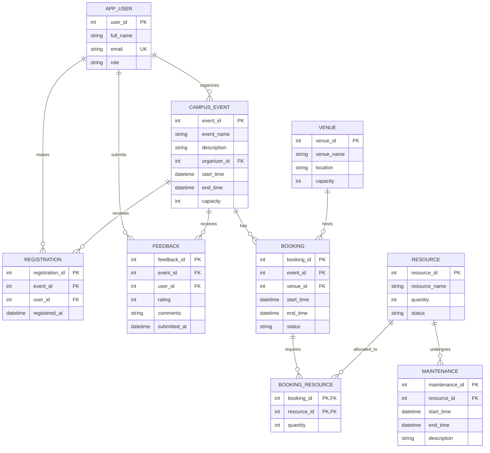

# Smart Campus Resource & Event Management System
## Entity Relationship Diagram

```mermaid
erDiagram
    APP_USER ||--o{ CAMPUS_EVENT : organizes
    APP_USER ||--o{ REGISTRATION : makes
    APP_USER ||--o{ FEEDBACK : submits

    CAMPUS_EVENT ||--o{ BOOKING : has
    CAMPUS_EVENT ||--o{ REGISTRATION : receives
    CAMPUS_EVENT ||--o{ FEEDBACK : receives

    VENUE ||--o{ BOOKING : hosts

    BOOKING ||--o{ BOOKING_RESOURCE : requires
    RESOURCE ||--o{ BOOKING_RESOURCE : allocated_to

    RESOURCE ||--o{ MAINTENANCE : undergoes

    APP_USER {
        int user_id PK
        string full_name
        string email UK
        string role
    }

    CAMPUS_EVENT {
        int event_id PK
        string event_name
        string description
        int organizer_id FK
        datetime start_time
        datetime end_time
        int capacity
    }

    VENUE {
        int venue_id PK
        string venue_name
        string location
        int capacity
    }

    RESOURCE {
        int resource_id PK
        string resource_name
        int quantity
        string status
    }

    BOOKING {
        int booking_id PK
        int event_id FK
        int venue_id FK
        datetime start_time
        datetime end_time
        string status
    }

    REGISTRATION {
        int registration_id PK
        int event_id FK
        int user_id FK
        datetime registered_at
    }

    MAINTENANCE {
        int maintenance_id PK
        int resource_id FK
        datetime start_time
        datetime end_time
        string description
    }

    FEEDBACK {
        int feedback_id PK
        int event_id FK
        int user_id FK
        int rating
        string comments
        datetime submitted_at
    }

    BOOKING_RESOURCE {
        int booking_id PK, FK
        int resource_id PK, FK
        int quantity
    }
```
