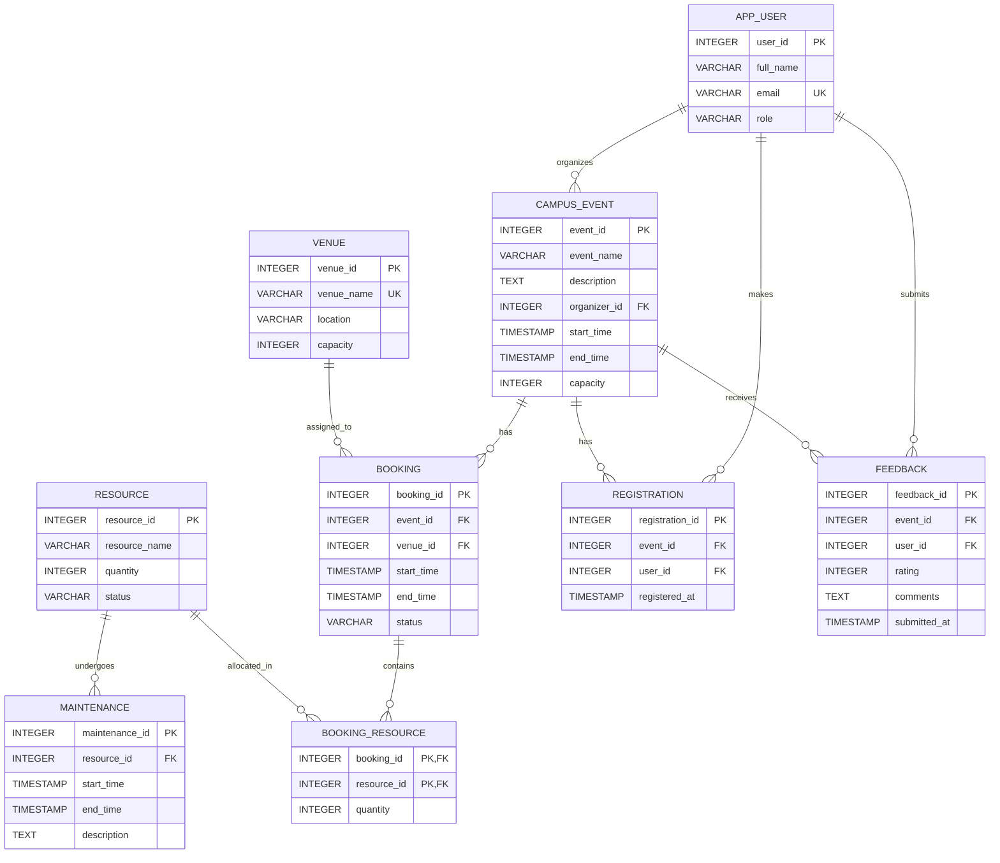

# Relational Schema – Smart Campus Resource & Event Management System

```mermaid
erDiagram

    APP_USER {
        INTEGER user_id PK
        VARCHAR full_name
        VARCHAR email UK
        VARCHAR role
    }

    CAMPUS_EVENT {
        INTEGER event_id PK
        VARCHAR event_name
        TEXT description
        INTEGER organizer_id FK
        TIMESTAMP start_time
        TIMESTAMP end_time
        INTEGER capacity
    }

    VENUE {
        INTEGER venue_id PK
        VARCHAR venue_name UK
        VARCHAR location
        INTEGER capacity
    }

    RESOURCE {
        INTEGER resource_id PK
        VARCHAR resource_name
        INTEGER quantity
        VARCHAR status
    }

    BOOKING {
        INTEGER booking_id PK
        INTEGER event_id FK
        INTEGER venue_id FK
        TIMESTAMP start_time
        TIMESTAMP end_time
        VARCHAR status
    }

    REGISTRATION {
        INTEGER registration_id PK
        INTEGER event_id FK
        INTEGER user_id FK
        TIMESTAMP registered_at
    }

    MAINTENANCE {
        INTEGER maintenance_id PK
        INTEGER resource_id FK
        TIMESTAMP start_time
        TIMESTAMP end_time
        TEXT description
    }

    FEEDBACK {
        INTEGER feedback_id PK
        INTEGER event_id FK
        INTEGER user_id FK
        INTEGER rating
        TEXT comments
        TIMESTAMP submitted_at
    }

    BOOKING_RESOURCE {
        INTEGER booking_id PK, FK
        INTEGER resource_id PK, FK
        INTEGER quantity
    }

    APP_USER ||--o{ CAMPUS_EVENT : organizes
    APP_USER ||--o{ REGISTRATION : makes
    APP_USER ||--o{ FEEDBACK : submits

    CAMPUS_EVENT ||--o{ REGISTRATION : has
    CAMPUS_EVENT ||--o{ FEEDBACK : receives
    CAMPUS_EVENT ||--o{ BOOKING : has

    VENUE ||--o{ BOOKING : assigned_to

    RESOURCE ||--o{ MAINTENANCE : undergoes

    BOOKING ||--o{ BOOKING_RESOURCE : contains
    RESOURCE ||--o{ BOOKING_RESOURCE : allocated_in
```
